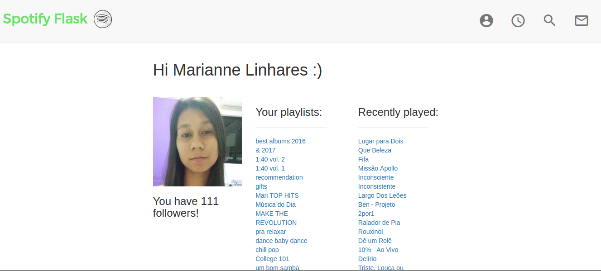

<head>
    <meta charset="UTF-8">
    <meta name="viewport" content="width=device-width, initial-scale=1.0">
    
</head>

<body>

    
    <h4>MAML in TF 2.0</h4>
    

        
Loading...

        <iframe src="https://ghbtns.com/github-btn.html?user=hereismari&repo=tensorflow-maml&type=star&count=true" frameborder="0" scrolling="0" title="GitHub" class="github-link"></iframe>
        <iframe src="https://ghbtns.com/github-btn.html?user=hereismari&repo=tensorflow-maml&type=fork&count=true" frameborder="0" scrolling="0" title="GitHub" class="github-link"></iframe>
    

    

        
Reproduction of the <a href='https://arxiv.org/abs/1703.03400'>MAML paper</a> using TensorFlow 2.0.

    

    
    <h4>Playing a game using TF JS</h4>
    

        
Loading...

        <iframe src="https://ghbtns.com/github-btn.html?user=hereismari&repo=playing-games-with-tfjs&type=star&count=true" frameborder="0" scrolling="0" class="github-link" title="GitHub"></iframe>
        <iframe src="https://ghbtns.com/github-btn.html?user=hereismari&repo=playing-games-with-tfjs&type=fork&count=true" frameborder="0" scrolling="0" class="github-link" title="GitHub"></iframe>
    

    

        
I’ve built a demo using TensorFlow JS to play different games just using a camera!

    

    
    <h4>Text generation with tf.eager</h4>
    

        
Loading...

        <iframe src="https://ghbtns.com/github-btn.html?user=hereismari&repo=tf-eager-text-generation&type=star&count=true" frameborder="0" scrolling="0" class="github-link" title="GitHub"></iframe>
        <iframe src="https://ghbtns.com/github-btn.html?user=hereismari&repo=tf-eager-text-generation&type=fork&count=true" frameborder="0" scrolling="0" class="github-link" title="GitHub"></iframe>
    

    

        
Modified version of <a href='https://www.tensorflow.org/tutorials/sequences/text_generation'>TensorFlow tutorial about text generation</a>
        using TensorFlow Eager. Including fun examples.

    

 

    
    <h4>MNIST on Android</h4>
    

        
Loading...

        <iframe src="https://ghbtns.com/github-btn.html?user=hereismari&repo=mnist-android-tensorflow&type=star&count=true" frameborder="0" scrolling="0" class="github-link" title="GitHub"></iframe>
        <iframe src="https://ghbtns.com/github-btn.html?user=hereismari&repo=mnist-android-tensorflow&type=fork&count=true" frameborder="0" scrolling="0" class="github-link" title="GitHub"></iframe>
    

    

        
A MNIST model ready to run on Android, including instructions about how to do it on your own.
           <a href="https://www.youtube.com/watch?v=kFWKdLOxykE&t=67s">This work was featured in a video from Siraj Raval</a>!!! The video has > 150k views!

    

    
    <h4>Easy 21 Assignment</h4>
    

        
Loading...

        <iframe src="https://ghbtns.com/github-btn.html?user=hereismari&repo=easy21&type=star&count=true" frameborder="0" scrolling="0" class="github-link" title="GitHub"></iframe>
        <iframe src="https://ghbtns.com/github-btn.html?user=hereismari&repo=easy21&type=fork&count=true" frameborder="0" scrolling="0" class="github-link" title="GitHub"></iframe>
    

    

        
An introduction to RL by solving the Easy21 assignment from the RL class by David Silver.

    

    
    <h4>Spotify-Flask</h4>
    

        
Loading...

        <iframe src="https://ghbtns.com/github-btn.html?user=hereismari&repo=spotify-flask&type=star&count=true" frameborder="0" scrolling="0" class="github-link" title="GitHub"></iframe>
        <iframe src="https://ghbtns.com/github-btn.html?user=hereismari&repo=spotify-flask&type=fork&count=true" frameborder="0" scrolling="0" class="github-link" title="GitHub"></iframe>
    

    

        
Request data from Spotify API using Flask. It also includes pre-built templates.

    

    
    <h4>Learning Deep Learning</h4>
    

        
Loading...

        <iframe src="https://ghbtns.com/github-btn.html?user=hereismari&repo=DeepLearning&type=star&count=true" frameborder="0" scrolling="0" class="github-link" title="GitHub"></iframe>
        <iframe src="https://ghbtns.com/github-btn.html?user=hereismari&repo=DeepLearning&type=fork&count=true" frameborder="0" scrolling="0" class="github-link" title="GitHub"></iframe>
    

    

        
This repository keeps track of my path towards getting started with Deep Learning (mainly with TensorFlow).

    

    
    <h4>UVaCPTracker</h4>
    

        
Loading...

        <iframe src="https://ghbtns.com/github-btn.html?user=hereismari&repo=UVaCPTracker&type=star&count=true" frameborder="0" scrolling="0" class="github-link" title="GitHub"></iframe>
        <iframe src="https://ghbtns.com/github-btn.html?user=hereismari&repo=UVaCPTracker&type=fork&count=true" frameborder="0" scrolling="0" class="github-link" title="GitHub"></iframe>
    

    

        
UVaCPTracker is a Chrome extension that makes it easier to keep track of how many problems in Competitive Programming a user has already solved. <a href="https://chrome.google.com/webstore/detail/uvacptracker/ankphgpmnicdkehhmnklhlodkfkecjbh" target="_blank">Download here!</a>

    

    
    <h4>SpotifYoutube</h4>
    

        
Loading...

        <iframe src="https://ghbtns.com/github-btn.html?user=hereismari&repo=spotifyoutube&type=star&count=true" frameborder="0" scrolling="0" class="github-link" title="GitHub"></iframe>
        <iframe src="https://ghbtns.com/github-btn.html?user=hereismari&repo=spotifyoutube&type=fork&count=true" frameborder="0" scrolling="0" class="github-link" title="GitHub"></iframe>
    

    

        
A Chrome extension that connects YouTube with Spotify through a button. It allows users to go from YouTube music videos to songs, albums, or bands in Spotify. <a href="https://chrome.google.com/webstore/detail/spotifyoutube/ankphgpmnicdkehhmnklhlodkfkecjbh" target="_blank">Download here!</a>

    

    
    <h4>A2OJ as CSV</h4>
    

        
Loading...

        <iframe src="https://ghbtns.com/github-btn.html?user=hereismari&repo=a2oj-as-csv&type=star&count=true" frameborder="0" scrolling="0" class="github-link" title="GitHub"></iframe>
        <iframe src="https://ghbtns.com/github-btn.html?user=hereismari&repo=a2oj-as-csv&type=fork&count=true" frameborder="0" scrolling="0" class="github-link" title="GitHub"></iframe>
    

    

        
Python script that takes an <a href="https://a2oj.com/">a2oj</a> standing and returns a CSV with the submissions information.

    

    
    <h4>Algorithms for Competitive Programming</h4>
    

        
Loading...

        <iframe src="https://ghbtns.com/github-btn.html?user=hereismari&repo=Programming&type=star&count=true" frameborder="0" scrolling="0" class="github-link" title="GitHub"></iframe>
        <iframe src="https://ghbtns.com/github-btn.html?user=hereismari&repo=Programming&type=fork&count=true" frameborder="0" scrolling="0" class="github-link" title="GitHub"></iframe>
    

    

        
Python script that takes an <a href="https://a2oj.com/">a2oj</a> standing and returns a CSV with the submissions information.

    

</body>
